# 아키텍처 문서

KSAT AI Benchmark의 시스템 아키텍처를 설명합니다.

## 전체 구조

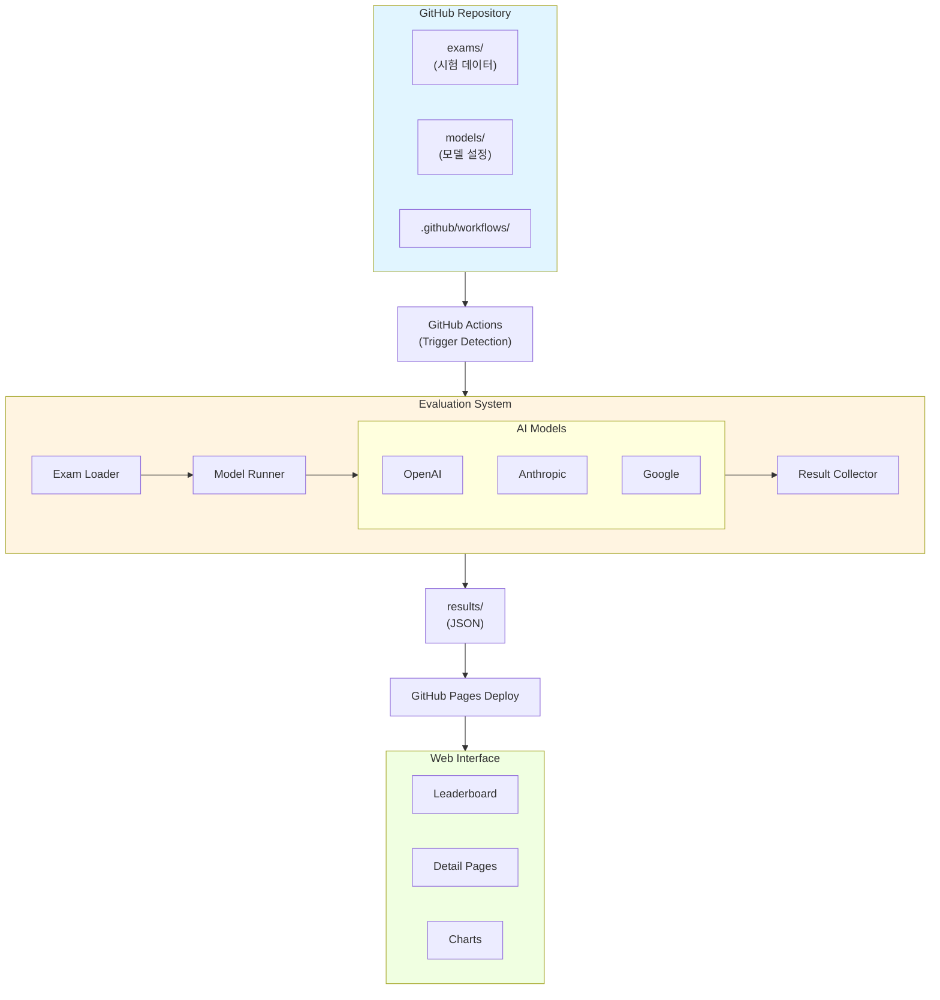

## 주요 컴포넌트

### 1. 데이터 레이어

#### Exam Data (시험 데이터)
- **위치**: `exams/`
- **형식**: JSON
- **역할**: 평가에 사용될 문제 저장
- **스키마**: 문제 ID, 텍스트, 선택지, 정답 등

#### Model Configuration (모델 설정)
- **위치**: `models/models.json`
- **형식**: JSON
- **역할**: 평가할 AI 모델 정의
- **내용**: 모델명, API 엔드포인트, 설정값 등

### 2. 평가 시스템 (Evaluation System)

#### Exam Loader
```python
class ExamLoader:
    """시험 파일을 로드하고 검증"""
    
    def load_exam(self, exam_path: str) -> Exam
    def validate_exam(self, exam: Exam) -> bool
```

**책임:**
- JSON 파일 읽기
- 스키마 검증
- 문제 데이터 구조화

#### Model Runner
```python
class ModelRunner:
    """AI 모델로 문제 풀이 실행"""
    
    def run_question(self, model: Model, question: Question) -> Answer
    def measure_time(self, func) -> Tuple[Result, float]
```

**책임:**
- 모델 API 호출
- 프롬프트 생성
- 응답 파싱
- 실행 시간 측정
- 에러 처리 및 재시도

#### Model Interfaces
```python
class BaseModel(ABC):
    """모든 모델의 기본 인터페이스"""
    
    @abstractmethod
    def generate(self, prompt: str) -> str
    
class OpenAIModel(BaseModel):
    """OpenAI API 구현"""
    
class AnthropicModel(BaseModel):
    """Anthropic API 구현"""
```

**책임:**
- API 클라이언트 초기화
- 프로바이더별 API 호출
- 응답 포맷 통일

#### Result Collector
```python
class ResultCollector:
    """평가 결과 수집 및 저장"""
    
    def collect_result(self, question: Question, answer: Answer) -> Result
    def save_results(self, results: List[Result], path: str)
    def calculate_score(self, results: List[Result]) -> Score
```

**책임:**
- 정답 비교
- 점수 계산
- 결과 JSON 생성
- 파일 저장

### 3. 자동화 레이어 (GitHub Actions)

#### Workflow: evaluate.yml
```yaml
name: Evaluate Models

on:
  push:
    paths:
      - 'exams/**'
      - 'models/models.json'
  workflow_dispatch:

jobs:
  evaluate:
    runs-on: ubuntu-latest
    steps:
      - Checkout
      - Setup Python
      - Install Dependencies
      - Run Evaluation
      - Save Results
      - Commit Results
```

**책임:**
- 변경 감지
- 평가 실행 환경 구성
- 결과 커밋

#### Workflow: deploy-pages.yml
```yaml
name: Deploy to GitHub Pages

on:
  push:
    paths:
      - 'results/**'

jobs:
  build-and-deploy:
    runs-on: ubuntu-latest
    steps:
      - Build Web Interface
      - Deploy to GitHub Pages
```

**책임:**
- 웹 인터페이스 빌드
- GitHub Pages 배포

### 4. 프레젠테이션 레이어 (Web Interface)

#### Components

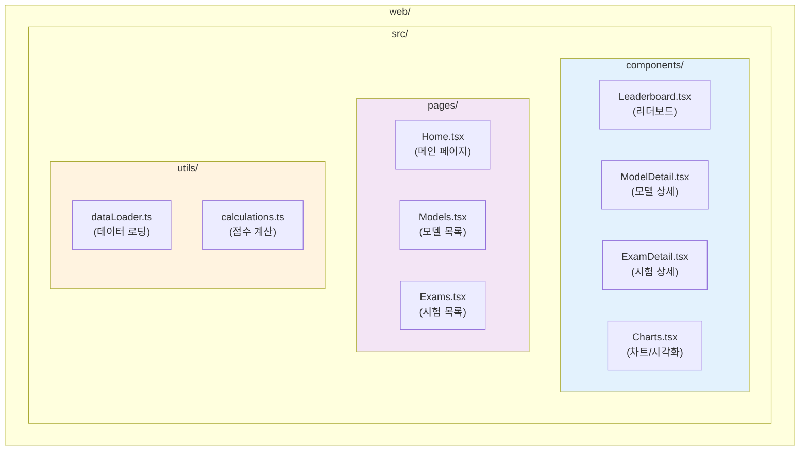

**책임:**
- 결과 데이터 시각화
- 인터랙티브 UI 제공
- 필터링 및 정렬

## 데이터 플로우

### 평가 프로세스

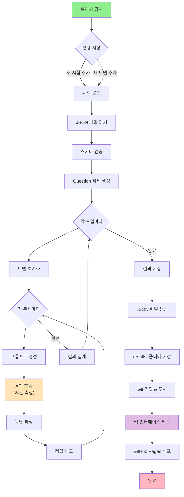

## 에러 처리

### 재시도 로직

```mermaid
flowchart TD
    start["API 호출 시작"] --> call["API 요청"]
    call --> check{"성공?"}
    check -->|Yes| success["결과 반환"]
    check -->|No| error{"에러 타입"}
    
    error -->|"APIError<br/>TimeoutError"| retry{"재시도 횟수<br/>< 3?"}
    error -->|"기타 에러"| log_error["에러 로그 기록"]
    
    retry -->|Yes| wait["지수 백오프<br/>(5초 × 2^n)"]
    wait --> call
    retry -->|No| log_fail["재시도 실패<br/>로그 기록"]
    
    log_fail --> fail["실패 반환"]
    log_error --> fail
    
    style success fill:#90EE90
    style fail fill:#FFB6C1
    style wait fill:#FFE4B5
```

### 재시도 코드 예시
```python
@retry(
    max_attempts=3,
    delay=5,
    backoff=2,
    exceptions=(APIError, TimeoutError)
)
def call_api(model, prompt):
    # API 호출
    pass
```

### 에러 타입

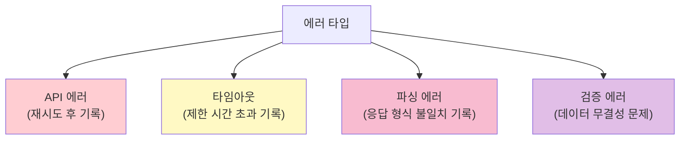

## 확장성

### 새로운 모델 추가

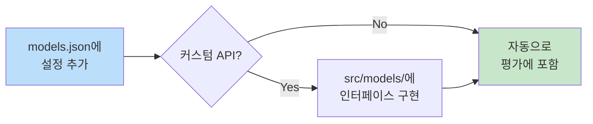

### 새로운 시험 추가

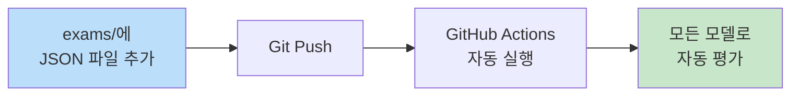

### 새로운 평가 지표 추가

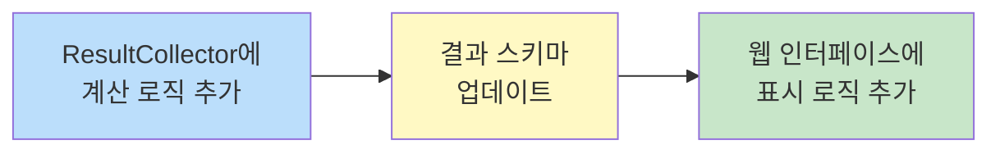

## 보안

### API 키 관리


### Rate Limiting

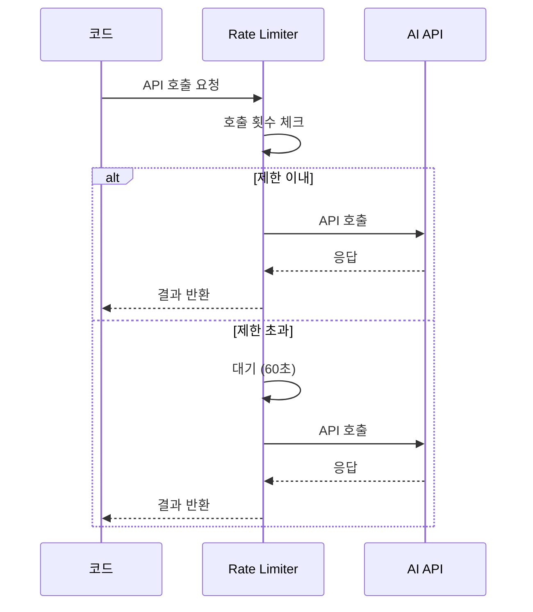

### Rate Limiting 코드 예시
```python
@rate_limit(max_calls=60, period=60)
def call_api():
    pass
```

## 성능 최적화

### 캐싱 전략

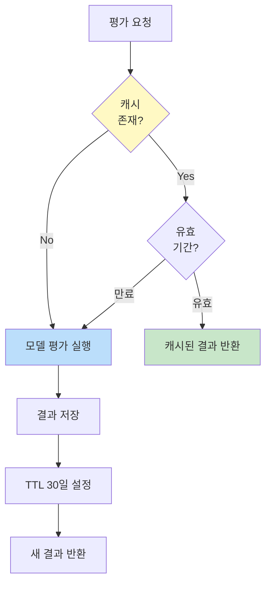

### 병렬 처리 아키텍처

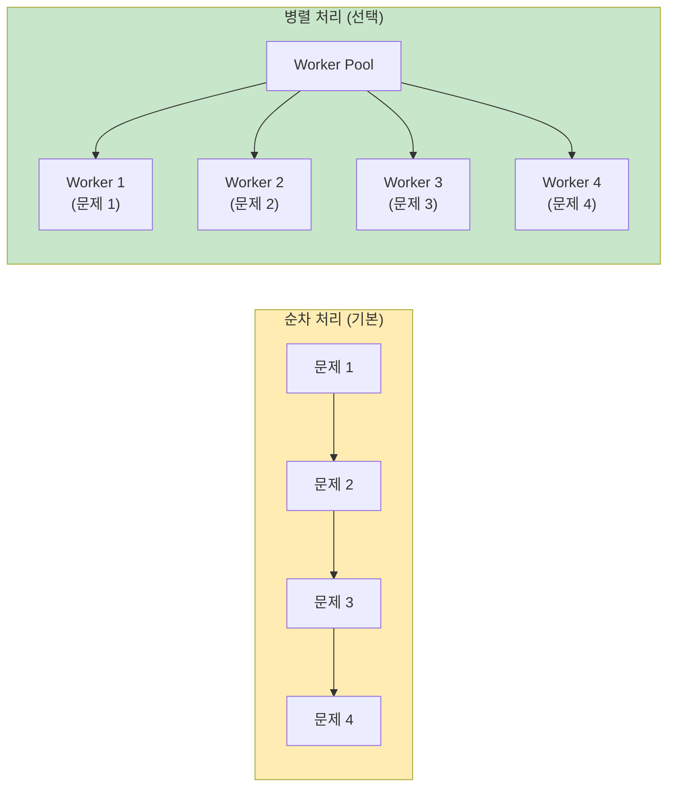

### 비용 최적화

```mermaid
flowchart TD
    start["평가 시작"] --> priority["모델 우선순위 정렬"]
    priority --> small["작은 모델<br/>(GPT-3.5, Haiku)"]
    small --> cache_check{"캐시 확인"}
    
    cache_check -->|"캐시 있음"| skip["호출 스킵"]
    cache_check -->|"캐시 없음"| call["API 호출"]
    
    call --> rate["Rate Limit 체크"]
    rate --> save["결과 캐시 저장"]
    
    skip --> medium["중간 모델<br/>(Sonnet)"]
    save --> medium
    
    medium --> large["큰 모델<br/>(GPT-4, Opus)"]
    
    style small fill:#c8e6c9
    style medium fill:#fff9c4
    style large fill:#ffcdd2
    style skip fill:#90EE90
```

## 모니터링

### 로깅 시스템

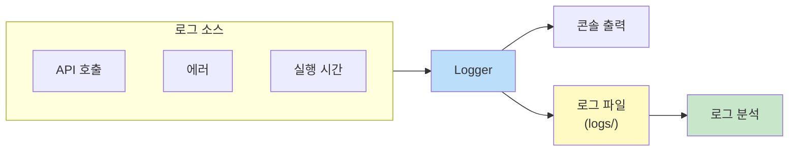

### 주요 메트릭

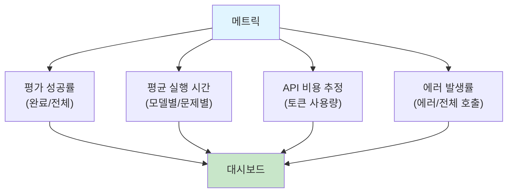

## 추후 개선 사항

1. **실시간 평가**: Webhook을 통한 즉시 평가
2. **병렬 처리**: 여러 모델 동시 실행
3. **분산 처리**: 대규모 평가를 위한 분산 시스템
4. **A/B 테스트**: 프롬프트 최적화
5. **머신러닝**: 난이도 자동 분류


